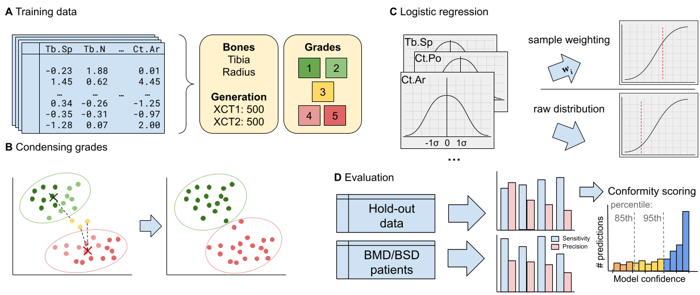

# MotionArtifactsBySD

This repository accompanies the publication "Estimating Motion Artifacts of HR-pQCT Scans Using Automatically Derived 
Standard Parameters of Bone Structure- and Density-Quantification".

Motion grading in  high resolution peripheral quantitative computed tomography (HR-pQCT) is a critical task for data 
validity, dependent on the operator. In routine clinical practice, validating the grading performed by technical staff 
is challenging. This is of critical importance since motion also affects the derived results of HR-pQCT. To address 
these issues, we focused on using established clinical HR-pQCT derived structure-density parameters to predict whether 
imaging samples are motion corrupted. Using a dataset of 1,000 scans from the tibia and radius, we employed a logistic 
regression model to classify whether scans are corrupted or not, condensing the task into a binary problem. 
Additionally, we evaluated the performance specifically for patients with altered bone microstructure.
We achieved a high sensitivity with an average of 0.7. Our results suggest that motion corrupted scans affect derived 
parameters differently than disease-related changes in bone microstructure. Thresholds for model trust were established 
to estimate the reliability of our predictions. Furthermore, feature importance was assessed, aligning with previous 
work on  motion artefacts.
Thus, we provide a low (computational) cost, efficient, and robust internal quality-control approach for grading 
derived data validity in clinical routine. Additionally, we enable cleaning large cohort datasets, enabling a 
retrospective evaluation without the need of image data retrieval or handling. By adding conformity thresholds, users 
can optimize their workflow to allow for high data quality.

**Notebooks in this repository were cleaned of potentially sensitive patient data. Scripts used to achieve our results are 
present in their entirety.
Results are also available in the `predictions` folder.**

## How to use

Given some dataset, the method discussed in our paper is present in `binary_elastic_approach.ipynb`. If you want to run 
models calibrated by us,
simply use the appropriate model files in `models/`.

>[!NOTE]
> We recommend `_balanced` models due to their generally better performance. XCT1 datasets should use the `_old` model files, 
while XCT2 datasets should use the `_new` model files.

An example use of calibrated models can be found in the `patient_eval.ipynb`.

Before using the models, please normalize your data according to the scalers provided in the `models/` folder. 
Additionally, ensure the order of your features is correct before passing them to the model. The correct order can be 
found in the `binary_elastic_approach.ipynb`.

## Cite

## Contact
If you have any questions, please do not hesitate to reach out to:
